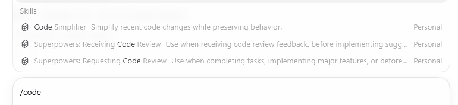

# Codex Code Simplifier

[简体中文](README.zh-CN.md) | English

A Codex plugin marketplace that packages a `code-simplifier` workflow for cleaning up recently modified code without changing behavior.

## Install In Codex App

Open **Plugins** -> **Add marketplace**, then use:

```text
Git reference: yidasanqian/codex-code-simplifier@main
Precise path: .agents/plugins
```

Install the `Code Simplifier` plugin from the marketplace after Codex loads it.

## Use

Use it from the Codex slash command picker. Type `/code`, select **Code Simplifier**, then add a concrete target:



```text
/code simplify my uncommitted changes without changing behavior
```

Or ask directly:

```text
Use code-simplifier on my recent changes.
```

The workflow focuses on files changed in the current session, preserves behavior, follows `AGENTS.md`, and verifies the affected surface where possible.

## What It Includes

- `plugins/code-simplifier/skills/code-simplifier/SKILL.md`: installable Codex skill.
- `plugins/code-simplifier/agents/code-simplifier.md`: plugin-level agent definition for Codex surfaces that support plugin agents.
- `.codex/agents/code-simplifier.toml`: optional project-level subagent template. Copy this file into a project's `.codex/agents/` directory if you want to use it as a custom subagent.

## Repository Layout

```text
.agents/plugins/marketplace.json
plugins/code-simplifier/.codex-plugin/plugin.json
plugins/code-simplifier/skills/code-simplifier/SKILL.md
plugins/code-simplifier/agents/code-simplifier.md
.codex/agents/code-simplifier.toml
```
